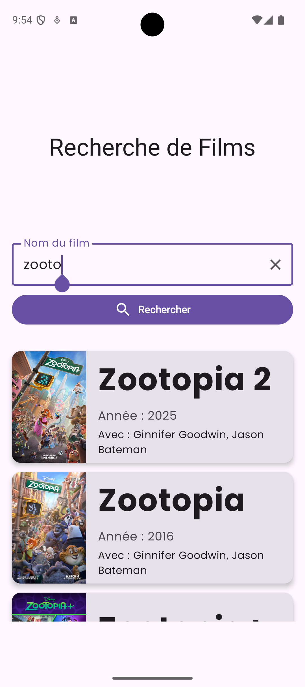
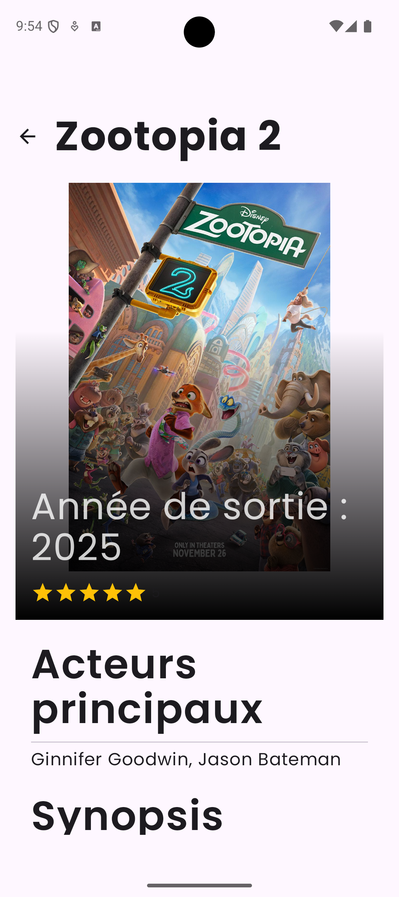

# IMT-FIL-A2-KOTLIN-MOVIE

Modern Android application built with Kotlin and Jetpack Compose that allows users to search for movies using a REST API. This project demonstrates a clean, scalable architecture using MVI, Repository pattern, and modern Android development tools.

| Search Screen                           | Details Screen                            |
|-----------------------------------------|-------------------------------------------|
|  |  |

## Core Features

-   **Movie Search:** Users can search for movies by typing a name into the search bar.
-   **Dynamic Results:** The app displays a list of movies matching the search query, showing the title, year, and actors.
-   **Detailed View:** Tapping on a movie from the search results navigates to a dedicated details screen, showing more information like the movie poster.
-   **User-Friendly Interface:** A clean and intuitive UI with clear actions, including a button to clear the current search text.

## Technical Stack & Architecture

This project is built following modern Android development principles to ensure it is robust, scalable, and maintainable.

-   **UI:**
    -   **Jetpack Compose:** The entire UI is built declaratively with Jetpack Compose, enabling a more efficient and powerful way to create native interfaces.
    -   **Material 3:** Implements the latest Material Design guidelines for a modern look and feel.

-   **Architecture:**
    -   **MVI (Model-View-Intent):** The app implements the MVI architecture to create a predictable and robust Unidirectional Data Flow (UDF). The UI (View) renders a single, immutable state object, while user actions are sent as Events (Intents) to the ViewModel for processing.
    -   **Clean Architecture Principles:** The project is structured into distinct layers (UI, Domain, Data) to ensure a strong separation of concerns.
        -   **Data Layer:** Handles data sources, containing the Retrofit API service and the Repository implementation.
        -   **Domain Layer:** Contains the core business models (e.g., `Movie`), independent of other layers.
        -   **UI Layer:** Responsible for displaying the application data on the screen and handling user interactions.
    -   **Repository Pattern:** A repository module is used to abstract the data sources from the rest of the app, providing a clean API for data access to the ViewModels.

-   **State Management:**
    -   **Unidirectional Data Flow (UDF):** The UI sends events to the ViewModel, which in turn updates its state. The UI then observes and reacts to these state changes.
    -   **Kotlin Flows & StateFlow:** Used to handle asynchronous data streams and expose the UI state from the ViewModel in a reactive and lifecycle-aware manner.

-   **Asynchronous Programming:**
    -   **Kotlin Coroutines:** Used extensively for managing background threads for network requests, ensuring the UI remains responsive.

-   **Networking:**
    -   **Retrofit:** A type-safe HTTP client for Android and Java to communicate with the REST API.
    -   **Gson:** Used for parsing JSON data from the API into Kotlin data classes.

-   **Navigation:**
    -   **Jetpack Navigation Compose:** Manages all in-app navigation, including passing arguments (like `movieId`) between composable screens.

### Data Flow Overview

The application follows a clear and logical data flow:

1.  **User Interaction (UI):** The `HomeScreen` captures a user event (e.g., typing in the search bar or clicking the search button).
2.  **ViewModel:** The event is passed to the `HomeViewModel`, which processes the request.
3.  **Repository:** The ViewModel calls a function in the Repository to fetch movie data.
4.  **API Service (Retrofit):** The Repository uses the Retrofit client to make a network call to the remote API.
5.  **Data Mapping:** The JSON response from the API (`MovieResponse`) is mapped to a clean domain model (`List<Movie>`) within the data layer. This prevents the API's data structure from leaking into the rest of the app.
6.  **State Update:** The ViewModel receives the domain models from the Repository and updates its `StateFlow`, which emits a new UI state.
7.  **UI Update:** The `HomeScreen` collects the `StateFlow` and recomposes automatically to display the new list of movies or loading/error states.
